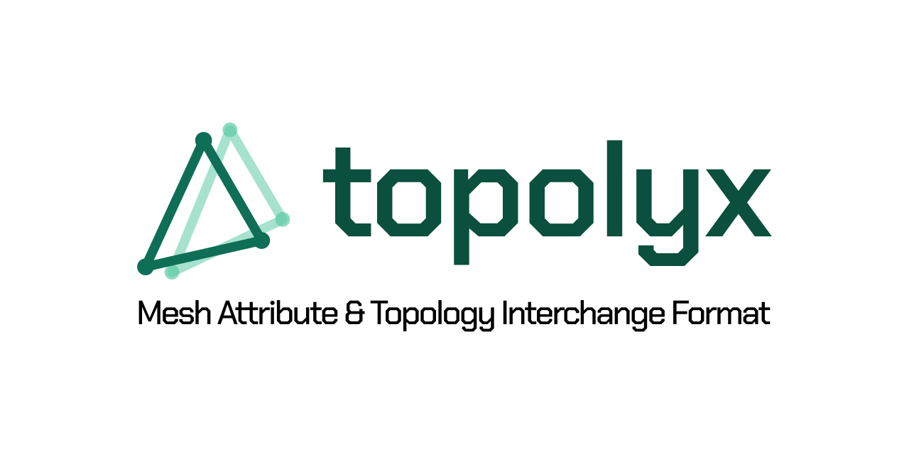

# Topolyx

[English(`en_US`)](/README.md) | [한국어(`ko_KR`)](/ko_KR/README.md)

> [!IMPORTANT]
> `Topolyx` is a portmanteau of **Topo**logy + **Poly**gon + e**X**change.\
> Its full name is `Mesh Attribute & Topology Interchange Format`, a format for bringing meshes created in Blender into a custom engine or tool while preserving their attribute data.

See the [specification](/SPECIFICATION.md) for details.

See [CHANGELOG.md](/CHANGELOG.md) for the specification's revision history and future plans.

## Topolyx Blender Extension

An extension for exporting/importing meshes created in Blender to/from the Topolyx format.

There are plans to upload it to the [official Blender extensions page](https://extensions.blender.org) in the future.

See [the corresponding repository](https://github.com/ym-0x309/topolyx_blender_extension) for details.
